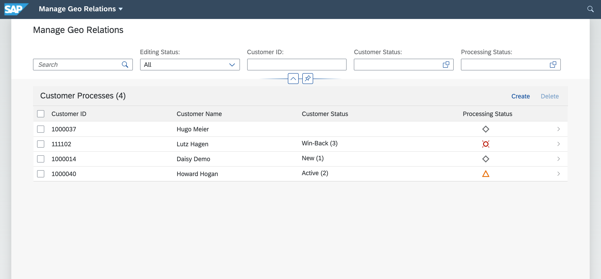
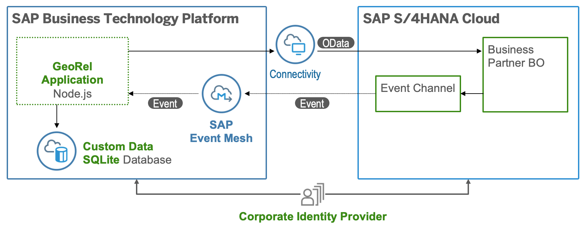

# Build an Event-Driven Extension of SAP S/4HANA Cloud

## Description

Extend SAP S/4HANA Cloud on the SAP Cloud Platform using state of the art methodologies and technologies. Put an event-driven architecture into action and use the Cloud Application Programming Model (CAP) building on S/4 events and SAP Cloud Platform Enterprise Messaging as event broker.

The main intent of this scenario is to complement an existing business process in an SAP solution, i.e. enhancing SAP S/4HANA Cloud with additional business process steps. This involves adding major logic and/or additional data and goes beyond simple UI changes. 

This scenario showcases:

- Building a side-by-side extension to SAP S/4HANA Cloud
- Setting up Eventing and consuming events from SAP S/4HANA Cloud via [SAP Cloud Platform Enterprise Messaging](https://help.sap.com/viewer/bf82e6b26456494cbdd197057c09979f/Cloud/en-US/df532e8735eb4322b00bfc7e42f84e8d.html)
- Consuming APIs from SAP S/4HANA Cloud 
- Developing an application on SAP Cloud Platform using the [SAP Cloud Application Programming Model(CAP)](https://cap.cloud.sap/docs/)
- Implementing a SAP Fiori Elements UI

## Business Scenario

The below business scenario is used to showcase how to build an S/4HANA Cloud Extension Application on SAP Cloud Platform:

In specific focus regions, we would like to follow up with newly created customers or existing customers that have had their data updated in our S/4HANA Cloud backend. External call center employees should do this follow up for us by contacting relevant customers by phone. At the same time, the call center employees have no access to our SAP S/4HANA system. We therefore provide a custom built extension application that is specifically designed and optimized for the task and that is supplied with relevant data in real time using an event-driven approach. 

**Current Position - What is the challenge?**

- Business Partner data available only in SAP S/4HANA system
- Call center personnel needs SAP S/4HANA access for their work
- No custom UI for specific geo marketing use case

**Destination - What is the outcome?**

- Changes in S/4HANA communicated via events in real time to extension
- Custom extension application works independently from S/4HANA
- Call center personnel only needs access to custom app

## Architecture

### Solution Diagram

The GeoRel extension application is developed using the SAP Cloud Application programming Model (CAP) and runs on the SAP Cloud Platform. It consumes platform services like Enterprise Messaging and the Connectivity Services. The events generated in S/4HANA Cloud are inserted into the Enterprise messaging queue. The application consumes these events and inserts relevant business partners into the local database. The GeoRel Application uses SAP S/4HANA REST APIs to read Business Partner data from the SAP S/4HANA Cloud system. 

## Requirements
* SAP S/4HANA Cloud system (release 1905 or newer)
* SAP Cloud Platform Cloud Foundry global account (trial accounts are not supported)

### For local development you would require the following:
* [Node js](https://nodejs.org/en/download/)
* [Cloud Foundry Command Line Interface (CLI)](https://github.com/cloudfoundry/cli#downloads)
* [Visual Studio Code](https://code.visualstudio.com/download)
* [SQLite ](https://sqlite.org/download.html)

### Entitlements

The application requires below set of SAP Cloud Platform Entitlements/Quota

| Service                           | Plan       | Number of Instances |
|-----------------------------------|------------|:-------------------:|
| Enterprise Messaging              | default    |          1          |
| Application Runtime               |            |          1          |
| Extension Factory Runtime         |            |          1          |

## Configuration

### Step 1: [Check Prerequisites](./documentation/mission/Prerequisites/README.md)

### Step 2: [Setup SAP Cloud Platform and S/4HANA Cloud](./documentation/mission/Setup%20Cloud%20Platform%20and%20S4HANA/README.md)

### Step 3: [Prepare Development Environment and Install Application](./documentation/mission/Development%20Environment%20and%20Application/README.md)

### Step 4: [Configure and Run Application](documentation/mission/Configure%20and%20Run%20Example%20Application/README.md)

### Step 5: [Demo Script](documentation/mission/Demo%20Script)

## Known Issues

No known issues.

## How to Obtain Support

In case you find a bug, or you need additional support, please [open an issue](https://github.com/SAP-samples/cloud-extension-s4hana-cloud-business-process/issues/new) here in GitHub.

## License
Copyright (c) 2020 SAP SE or an SAP affiliate company. All rights reserved. This project is licensed under the Apache Software License, version 2.0 except as noted otherwise in the [LICENSE](LICENSES/Apache-2.0.txt) file.
